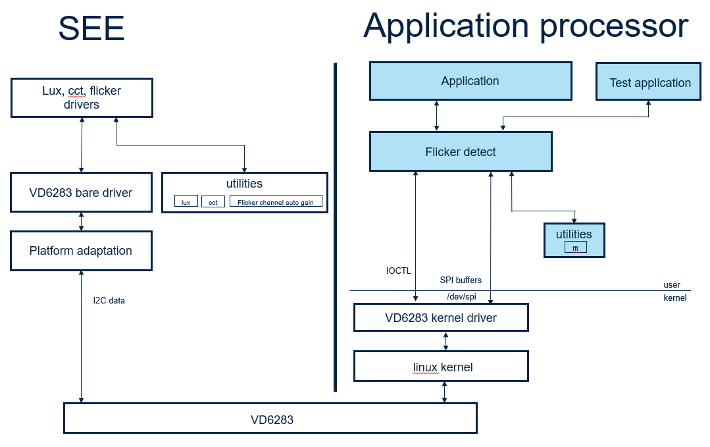
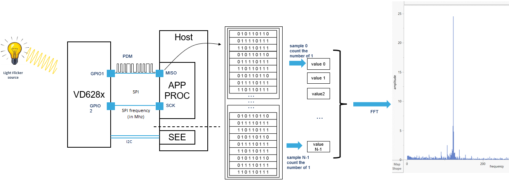

# STSW-VD6283-XRU
User driver and test app for VD6283 light flickering detect for xr2gen3 Qualcomm ref design platform

This repository contains a driver and a test application that calculates the main frequencies of an ambient flickering light
It relies on linux kernel driver (STSW-VD6283-XR) that implements a bridge to convey SPI data 

The following diagram describes a software overview. 

The VD6283 is connected through I2C to the sensor hub processor. 
The sensor hub processor then controls the device (initialization, start, stop) and calculates lux and cct from the light counters information extracted from the i2c channel.
It also sends the START and STOP commands to control the flicker channel.

The clear channel of the VD6283 device is used to detect and extract the frequency of the ambient light
As described in the figure above the SPI bus of the processor to which the VD6283 device is connected to, gets PDM data from GPIO1 at the same frequency of the SPI bus.

